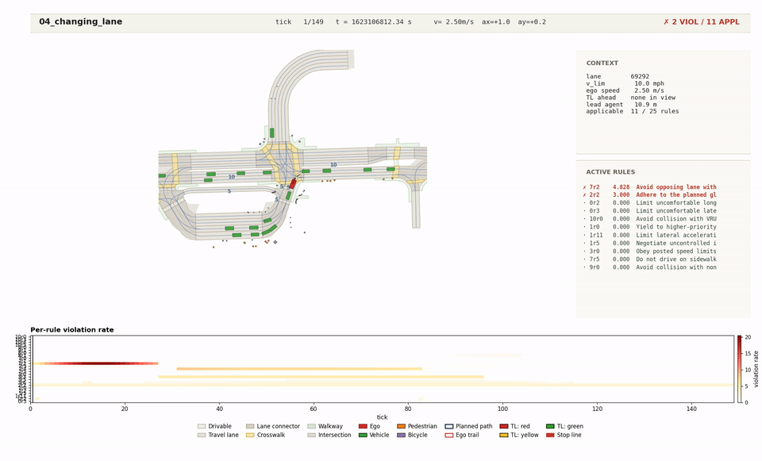
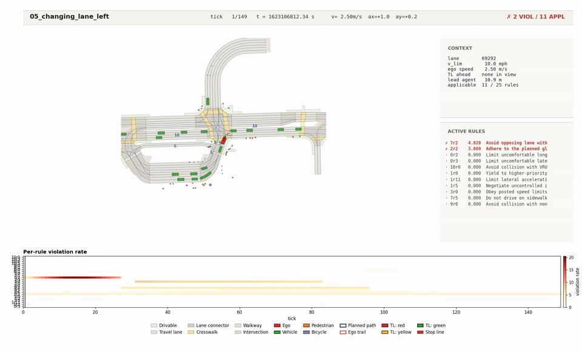

# LexiCone

**Lexicographic Constraint Programming for Trajectory Model Predictive Control of Autonomous Vehicles**

A complete deployment of the *Lexicographic Constraint Programming* (LCP) framework for trajectory Model Predictive Control (MPC) on the official nuPlan closed-loop simulator. The project ships (i) a theoretical paper proving when a single weighted-sum (WS) Nonlinear Program (NLP) solve substitutes exactly for an $L+1$-stage lexicographic cascade, (ii) a full reference implementation in three operational modes (legacy single-tier baseline, LCP-WS, and LCP-cascade), (iii) a comparative-effectiveness protocol over $400$ simulation runs on $16$ nuPlan-mini scenarios, and (iv) a $277$-figure IEEE-Transactions-grade artefact suite plus an extensively documented codebase.


*The operational **LCP-WS-$L_1$** planner traversing a signalised intersection (scenario 16 of the 16-scenario nuPlan-mini benchmark, rendered from the actual simulation log). **Header band** (top): scenario label, current tick and wall time, ego state ($v$, $a_x$, $a_y$), and a compliance status badge — green when no rule fires, red when one or more rules are violated. **Map view** (left): clean top-down rendering with the ego in red, agents in green (vehicles) / orange (pedestrians) / purple (cyclists) etc., planned 3-second MPC trajectory as a dashed dark-blue polyline, traffic-light markers as filled circles coloured by state, and lane geometry in beige. **Sidebar** (right): a context card with the ego's current lane id, posted speed limit, distance to the next traffic light + its state, distance to the in-lane lead, and the applicable-rule count; below that an active-rules panel sorted by violation severity and colour-coded by priority level. **Violation strip** (bottom): per-rule violation rate over the entire episode with a tick cursor. **Legend** (very bottom): map-feature key. Browse the full gallery of all 16 scenarios with embedded GIFs and per-scenario narrative at [`workspace/examples/outputs/12_batch_two_level_mpc_planner/README.md`](workspace/examples/outputs/12_batch_two_level_mpc_planner/README.md).*

---

## Contents

1. [What this repository is](#what-this-repository-is)
2. [The research problem](#the-research-problem)
3. [The LCP framework — what we proved](#the-lcp-framework--what-we-proved)
4. [Codebase architecture](#codebase-architecture)
5. [Quick-start commands](#quick-start-commands)
6. [Visual gallery of the 16 benchmark scenarios](#visual-gallery-of-the-16-benchmark-scenarios)
7. [The comparative-effectiveness protocol](#the-comparative-effectiveness-protocol)
8. [Results to date](#results-to-date)
9. [Documentation map](#documentation-map)
10. [Reproducibility](#reproducibility)
11. [Dependencies](#dependencies)
12. [Citation](#citation)
13. [Status](#status)
14. [References](#references)

---

## What this repository is

The repository hosts four complementary deliverables:

1. **The LCP theoretical framework.** A research paper developing a geometric equivalence theorem (Theorem 4.1) between the $L+1$-stage lex cascade and a single weighted-sum solve at calibrated weights $w^\dagger$, plus constructive algorithms (Algorithm 1A for $L_1$ exact equivalence and Algorithm 1B for $L_2$ tolerance compliance) that compute those weights from finite-dimensional gradient data at the lex optimum. The paper is $15$ sections long and includes Section 14 — *Implementation Lessons from a Closed-Loop Deployment* — that distils 11 operational primitives the framework requires in practice (sequential linearisation for non-convex dynamics, polygon-to-half-plane reduction, per-tick applicability masking with a static slot budget, cross-step coupling proxies, ego-local-frame solving + $L_1$ Tikhonov regulariser for numerical conditioning, calibration drift handling, cascade-per-tick as the offline default, serialisation-tolerance contract for stateful solver wrappers). The load-bearing claims are inlined in §3 below.

2. **The reference implementation.** Application code at [`workspace/`](workspace/) realising the framework as a real MPC trajectory planner that runs inside the official nuPlan closed-loop simulator. The two-level planner ([`workspace/lexicone/planning/`](workspace/lexicone/planning/)) has three operational modes selectable via a Hydra YAML key: **legacy single-tier MPC** (the baseline, equivalent to a flat-weight planner — `penalty_form: null`), **LCP weighted-sum** (the operational mode — `penalty_form: l1` or `l2`, `runtime_mode: ws`), and **LCP lex cascade** (the formally lex-optimal mode — `runtime_mode: cascade`). Sixteen of the observer's twenty-five rules are wired as convex LCP constraints with per-level epigraph slacks; the remaining nine are multi-tick state machines (mandatory-stop approach, yield-priority arbitration, etc.) that fall outside the framework's per-step convex template.

3. **A comparative-effectiveness protocol.** A multi-seed, multi-condition driver at [`workspace/examples/13_run_protocol.py`](workspace/examples/13_run_protocol.py) that wraps the per-tick simulation runner across five planner conditions ($C_0$ legacy / $C_1$ LCP-WS-$L_1$ / $C_2$ same with three Sequential Linear Programming (SLP) iterations / $C_3$ LCP-WS-$L_2$ / $C_4$ LCP lex cascade) × $16$ nuPlan-mini scenarios × $5$ random seeds for a total of $400$ simulation runs. The protocol defines *better* structurally — as lex-Pareto dominance on the per-priority-level violation vector — and emits a headline lex-win-rate with exact binomial $95\,\%$ confidence interval plus Bias-Corrected accelerated (BCa) bootstrap per-level percent-reduction intervals.

4. **A $277$-figure artefact suite.** Paper-grade figures at IEEE Transactions typography (Times serif, $10\,\mathrm{pt}$ body, $300\,\mathrm{dpi}$, $3.50\,\mathrm{in}$ single-column or $7.16\,\mathrm{in}$ double-column widths) covering per-scenario detail views ($96$), cross-scenario aggregates ($10$), conceptual / theoretical figures ($12$), and per-rule peak-violation snapshots ($159$). The pipeline is at [`workspace/scripts/`](workspace/scripts/) and re-generates from one shell command.

A separate **comprehensive project report** (~$12{,}000$ words, $11$ IEEE-style sections plus appendices) serves as the canonical source document for an eventual journal submission. Its sections cover (I) Introduction, (II) Related Work, (III) The LCP Framework — Summarised Claims, (IV) The Observer Subpackage, (V) The Planning Subpackage, (VI) Experimental Methods, (VII) Definition of "Better", (VIII) Results, (IX) Implementation Lessons, (X) Discussion, (XI) Conclusions and Future Work, plus appendices A–E (file-by-file glossary, abbreviation glossary, hyperparameter reference, paper-extraction map, re-generation commands). Both the framework paper and the comprehensive report live in the `References/` folder which is **excluded from the GitHub commit** by `.gitignore` (entry `References/*.*`); all load-bearing claims, equations, and tables from them are inlined into the relevant README files throughout this repository.

---

## The research problem

Autonomous-vehicle (AV) trajectory planning is structurally a multi-objective problem under a *prioritised* rulebook: collision avoidance must take precedence over traffic-law compliance, which must take precedence over passenger comfort, which must take precedence over trip efficiency. The literature has two prevailing approaches and each has a documented weakness.

**Flat weighted-sum (WS) cost functions** — the standard practice in real-time MPC — collapse this priority structure into a single scalar via hand-tuned weights. The hazard is that small perturbations in any weight can flip the trajectory's qualitative behaviour, and low-priority terms can mathematically out-vote high-priority terms when their numerical scales drift. There is no formal guarantee that the resulting plan respects the rulebook's priority semantics.

**Lexicographic (lex) cascades** — sequential constrained optimisations in which level $i+1$ is solved subject to level $i$'s optimum being preserved — give the correct priority semantics by construction. The Hierarchical Quadratic Programming (HQP) approach of Escande, Mansard, and Wieber is the canonical realisation for the convex-QP setting. But the cascade requires $L+1$ NLP solves per planner tick, which at $L=3$ priority levels and a $10\,\mathrm{Hz}$ planning rate is generally prohibitive for real-time deployment.

The **LCP framework** addresses this tension by giving the conditions under which a single WS solve substitutes exactly for the full cascade — and providing constructive algorithms to compute the equivalent weights from offline gradient data at the lex optimum. The framework's contribution is *neither another rulebook taxonomy nor another MPC formulation*, but a *connection*: it shows when the two existing approaches collapse into the same answer and gives the recipe for finding the equivalence.

The contribution of *this codebase* is the **first full deployment** of LCP on a realistic AV planner stack, with explicit instrumentation of the framework's failure modes, a deployment-grade engineering layer (Sequential Linear Programming for nonlinear dynamics, polygon-to-half-plane reductions for non-convex rulebook constraints, per-tick applicability masking, race-free parallelism for the comparative protocol), and a rigorous empirical evaluation against the legacy baseline.

---

## The LCP framework — what we proved

The load-bearing statements (full proofs live in the framework paper, which is in the gitignored `References/` folder; the statements themselves are inlined here):

**Setting.** A convex constrained-optimisation problem over a compact convex set $\mathcal{Z} \subset \mathbb{R}^n$ with $L$ priority-ordered constraint groups indexed $i = 1, \ldots, L$, each encoding a violation functional

$$V_i(z) \triangleq \sum_{j,k} \phi(g_{i,j,k}(z)), \qquad \phi(u) = [u]_+ \text{ or } [u]_+^2, \tag{1}$$

plus a convex performance objective $J(z)$ at level $L+1$. The choice $\phi(u) = [u]_+$ defines the $L_1$ regime; $\phi(u) = [u]_+^2$ the $L_2$ regime.

**Lex cascade.** Solve $L+1$ NLPs in sequence: $V_1^\star = \min V_1(z)$, then $V_2^\star = \min V_2(z)$ subject to $V_1(z) \le V_1^\star$, and so on. The optimum $z_{\text{lex}}^\star$ is lex-optimal by construction. Slow but principled.

**Weighted sum.** For weight vector $w \in \mathbb{R}_{>0}^L$, solve one NLP:

$$z_{\text{ws}}^\star(w) \in \arg\min_{z \in \mathcal{Z}} \sum_i w_i V_i(z) + J(z). \tag{2}$$

Fast but priority-blind unless $w$ is calibrated.

**Theorem 4.1 (Support-Normal Equivalence).** Let $\overline{\mathcal{P}} \triangleq \Phi(\mathcal{Z}) + \mathbb{R}_{\ge 0}^{L+1}$ be the upper image of $\mathcal{Z}$ under $\Phi(z) = (V_1, \ldots, V_L, J)$ and let $p^\star$ be the lex point. Then

$$z_{\text{lex}}^\star \in \arg\min \text{WS}(w) \iff w \in \widehat{\Omega}(p^\star), \tag{3}$$

where $\widehat{\Omega}(p^\star)$ is the normal cone of $\overline{\mathcal{P}}$ at $p^\star$. The unit-performance slice $\Omega(p^\star) = \widehat{\Omega}(p^\star) \cap \{J=1\}$ is the locus of admissible weights.

**Algorithm 1A ($L_1$, exact equivalence; paper §9.3).** Under cascade Linear Independence Constraint Qualification (LICQ), $\Omega(p^\star)$ is a full-dimensional polyhedron with an explicit half-space description derivable by Fourier–Motzkin elimination of the lex Karush–Kuhn–Tucker (KKT) multipliers. The robust weight $w^\dagger$ is the Chebyshev centre of $\Omega(p^\star)$ intersected with an operator-supplied weight box.

**Algorithm 1B ($L_2$, tolerance compliance; paper §9.4).** Under the asymptotic regime $V_i \sim O(1/w_i^2)$, the compliance region $\Omega_b^{\boldsymbol{\epsilon}}(p^\star)$ admits a pointwise threshold characterisation. The robust weight is the Chebyshev centre under coupled-linear constraints.

**Operational architecture.** Offline (once per scenario class): run the cascade to get $p^\star$, then Algorithm 1A or 1B to get $w^\dagger$. Online (per tick): solve WS at $w^\dagger$ in a single NLP solve, then verify the runtime compliance vector $b_\epsilon(z_{\text{ws}})$ matches the cached $b_\epsilon(z_{\text{lex}}^\star)$. The framework also exposes its own failure modes (degenerate active set, non-convexity) via diagnostic checks.

The implementation realises every load-bearing piece: the offline cascade and Algorithm 1A / 1B live in [`workspace/lexicone/planning/lex_cascade.py`](workspace/lexicone/planning/lex_cascade.py) and [`workspace/lexicone/planning/weight_calibration.py`](workspace/lexicone/planning/weight_calibration.py); the convex linearised MPC with per-level epigraph slacks is in [`workspace/lexicone/planning/lcp_mpc.py`](workspace/lexicone/planning/lcp_mpc.py); the runtime compliance check is in [`workspace/lexicone/planning/compliance_checker.py`](workspace/lexicone/planning/compliance_checker.py); the per-scenario-class calibration cache is at [`workspace/lexicone/planning/calibration_cache.py`](workspace/lexicone/planning/calibration_cache.py).

---

## Codebase architecture

```text
nuplan-project/
├── README.md                                       ← you are here
├── References/                                     ← gitignored (References/*.*); contents inlined into READMEs
├── workspace/                                      ← application code (everything builds from here)
│   ├── README.md
│   ├── mp4_to_gif_recursive.sh                     (utility — MP4 → GIF for the embedded simulation playbacks)
│   ├── lexicone/                                   ← LCP package
│   │   ├── observer/                               ← 25-rule per-tick rulebook engine
│   │   │   ├── engine.py                           (RuleEngine: step / run_replay / summary)
│   │   │   ├── rule.py                             (ObserverRule ABC)
│   │   │   ├── context.py                          (SceneContext with cached_property derivations)
│   │   │   ├── types.py                            (SceneSnapshot, RuleEvaluation, EpisodeSummary, …)
│   │   │   ├── registry.py                         (build_default_rules → 25 rule instances)
│   │   │   ├── geometry.py                         (Shapely-based footprint / projection helpers)
│   │   │   ├── nuplan_adapter.py                   (NuPlanSceneSource — live scenario)
│   │   │   ├── simulation_log_adapter.py           (NuPlanSimulationLogSource — saved log)
│   │   │   ├── rules/                              (25 *.py files, one per rule)
│   │   │   └── tests/
│   │   └── planning/                               ← two-level MPC planner (legacy + LCP modes)
│   │       ├── bicycle_model.py                    (CasADi symbolic kinematic bicycle, RK4)
│   │       ├── reference_path.py                   (arc-length-parameterised polyline)
│   │       ├── global_planner.py                   (periodic BFS over lane graph)
│   │       ├── trajectory_planner.py               (LEGACY single-tier MPC)
│   │       ├── two_level_planner.py                (TwoLevelMPCPlanner — orchestrator)
│   │       ├── lcp_mpc.py                          (LCPTrajectoryPlanner — convex linearised LCP MPC)
│   │       ├── lex_cascade.py                      (run_cascade — L+1-stage lex cascade per tick)
│   │       ├── weight_calibration.py               (Algorithm 1A + 1B)
│   │       ├── slp_linearisation.py                (BicycleLinearisation + SLP residual)
│   │       ├── rule_encoder.py                     (16 active rule encoders + 3 stubs)
│   │       ├── compliance_checker.py               (runtime b_ε(z_ws) vs b_ε(z_lex*))
│   │       ├── calibration_cache.py                (JSON-backed scenario-class cache for w†)
│   │       ├── map_lifter.py                       (per-tick map lifting into ego-local frame)
│   │       ├── config/planner/two_level_mpc_planner.yaml  (Hydra config)
│   │       ├── docs/full_rule_wiring_plan.md
│   │       └── tests/                              (12 test files / 98 tests)
│   ├── examples/
│   │   ├── 01_…py … 12_batch_two_level_mpc_planner.py   (12 demos + 1 batch)
│   │   ├── 13_run_protocol.py                      (comparative-protocol multi-seed driver)
│   │   ├── analyze_protocol.py                     (post-batch per-level + lex-dominance analysis)
│   │   ├── metrics_smoothness.py                   (msgpack-replay smoothness extractor)
│   │   ├── simulation.py                           (synthetic 10 Hz harness)
│   │   ├── planners.py                             (6 pedagogical planners)
│   │   ├── scenarios.py                            (canned synthetic worlds)
│   │   ├── visualizer.py                           (IEEE-styled MP4 / summary PNG / CSV renderer)
│   │   └── outputs/                                ← all generated artefacts
│   │       ├── 12_batch_two_level_mpc_planner/     ← 16-scenario LCP-WS-L₁ batch + 16 embedded-GIF READMEs
│   │       ├── 13_protocol/                        ← 400-run comparative-effectiveness output (in progress)
│   │       └── artifacts/                          ← 277 IEEE-grade figures (per_scenario + aggregate + theory + violations)
│   ├── scripts/
│   │   ├── ieee_style.py                           (single source of truth for IEEE typography)
│   │   ├── generate_artifacts.py                   (118-PNG static set)
│   │   └── generate_violation_snapshots.py         (159-PNG violation set)
│   └── tests/                                      (top-level placeholder; per-package tests in lexicone/)
├── DevContainers/                                  (nuPlan devkit + demos, submodule)
└── exp/                                            (NUPLAN_EXP_ROOT for nuPlan simulator intermediates)
```

Every directory of consequence carries its own `README.md`; see the [documentation map](#documentation-map) below.

### The two-level planner — pipeline

```text
┌────────────────── nuPlan simulator (10 Hz) ──────────────────┐
│  PlannerInput ──┐                                             │
│                 ▼                                             │
│  TwoLevelMPCPlanner.compute_planner_trajectory(input)         │
│                 │                                             │
│         ┌───────┴─────────┐                                   │
│         │ replan needed?  │                                   │
│         │ (timer or       │                                   │
│         │  drift > 5 m)   │                                   │
│         └───────┬─────────┘                                   │
│                 │                                             │
│       yes ─▶ GlobalRoutePlanner.plan(ego) → ReferencePath     │
│                                                               │
│     every tick ▼                                              │
│  ┌──────────────────────────────────────────────────────────┐ │
│  │ penalty_form is null?                                    │ │
│  │  yes ─▶ MPCTrajectoryPlanner.solve()  (legacy)           │ │
│  │  no  ─▶ LCPTrajectoryPlanner._solve_lcp_tick()           │ │
│  │          1. MapLifter.view() → ego-local map view        │ │
│  │          2. ruleset.encode_all(ctx) → LCPRulePack         │ │
│  │          3. BicycleLinearisation around warm-start       │ │
│  │          4. SLP outer iter (default 1, up to 5):         │ │
│  │             runtime_mode = "ws"      → LCPMPC WS solve   │ │
│  │             runtime_mode = "cascade" → run_cascade()     │ │
│  │          5. ComplianceChecker.check (logs mismatch)      │ │
│  └──────────────────────────────────────────────────────────┘ │
│                 │                                             │
│                 ▼                                             │
│   InterpolatedTrajectory → nuPlan's TwoStageController        │
│   (LQR + kinematic bicycle) advances the simulator's ego.     │
└───────────────────────────────────────────────────────────────┘
```

### Rule encoders — the 16 LCP-controlled rules

[`make_default_ruleset()`](workspace/lexicone/planning/rule_encoder.py) returns three priority-level lists ($L_1$ = Safety, $L_2$ = Legal, $L_3$ = Comfort) wrapping 16 active encoders + 3 stubs. The active set:

| Level | Encoder | Observer rule(s) | Convex form |
|---|---|---|---|
| L₁ | `CollisionRule` (slots = 8) | `9r0` + `10r0` | Inflated-circle keep-out per agent |
| L₁ | `LaneCorridorRule` (slots = 2) | `7r0` | Two linear half-planes around route centreline |
| L₁ | `SidewalkDriveRule` (slots = 4) | `7r5` | Closest-face half-plane of nearest walkway polygon |
| L₂ | `SpeedLimitRule` (slots = 1) | `3r0` | $v_k - v_{\lim}(s_k) \le 0$ |
| L₂ | `OpposingLaneRule` (slots = 2) | `7r2` | Half-plane vs nearest opposing-direction lane |
| L₂ | `OneWayDirectionRule` (slots = 2) | `7r3` | Looser variant of `7r2` |
| L₂ | `TrafficLightRule` (slots = 1) | `7r1` | $x_{\text{ego},k} \le x_{\text{stop}} - \text{buf}$ when TL is RED/YELLOW |
| L₃ | `SafeHeadwayRule` (slots = 1) | `3r3` | $t_\text{hw} v_k + d_{\min} - \text{gap}_k \le 0$ |
| L₃ | `LongitudinalComfortRule` (slots = 2) | `0r2` | $|a_{x,k}| \le a_{x,\max}^{\text{comf}}$ |
| L₃ | `LateralAccelerationRule` (slots = 2) | `1r11` | $|a_{y,k}| \le a_{y,\max}^{\text{comf}}$ |
| L₃ | `LateralClearanceRule` (slots = 2) | `3r5` | Y-band keep-out vs adjacent agents |
| L₃ | `LateralComfortRule` (slots = 2) | `0r3` | Soft cap on $|\delta|$ as cross-step jerk proxy |

Per-level slot budgets: $\{16, 7, 11\}$. The OCP carries $34$ epigraph slack variables per step × $30$ steps $\approx 1020$ extra decision variables vs the legacy MPC.

The remaining nine observer rules (`10r3`, `10r4`, `9r1`, `8r0`, `8r1`, `2r2`, `1r0`, `1r2`, `1r5`) are multi-tick state machines that fall outside the framework's per-step convex template; they stay observer-only and serve as the *invariant control* set in the comparative protocol. The partition is enforced at import time by [`workspace/lexicone/planning/tests/test_rule_level_mapping.py`](workspace/lexicone/planning/tests/test_rule_level_mapping.py).

---

## Quick-start commands

```bash
cd workspace

# Run a single nuPlan-mini scenario with the LCP planner
python examples/11_simulated_two_level_mpc_planner.py

# Run the 16-scenario batch in LCP-WS-L₁ mode (~50 min sequential)
python examples/12_batch_two_level_mpc_planner.py \
    --penalty-form l1 --runtime-mode ws

# Run the legacy single-tier MPC baseline (drop --penalty-form)
python examples/12_batch_two_level_mpc_planner.py

# Run the formally-lex-optimal cascade mode (~16 min/scenario, ~4 hr total)
python examples/12_batch_two_level_mpc_planner.py \
    --penalty-form l1 --runtime-mode cascade

# Run the full comparative-effectiveness protocol
#   5 conditions × 16 scenarios × 5 seeds = 400 runs
#   ~11–14 hr at 4-way parallelism
python examples/13_run_protocol.py \
    --conditions C0,C1,C2,C3,C4 --seeds 7,17,27,37,47 \
    --parallel 4 --resume

# Generate the 277-figure IEEE artefact zoo from the LCP-WS-L₁ batch
python scripts/generate_artifacts.py             # 118 plots (per_scenario + aggregate + theory)
python scripts/generate_violation_snapshots.py   # 159 peak-violation snapshots + galleries

# Post-batch analysis + F1–F3 IEEE figures
python examples/analyze_protocol.py \
    --protocol-root examples/outputs/13_protocol \
    --baseline C0_legacy

# Smoothness post-process (F7 input)
python examples/metrics_smoothness.py \
    --protocol-root examples/outputs/13_protocol \
    --out examples/outputs/13_protocol/figures/smoothness.csv

# Convert MP4 simulation playbacks to GitHub-embeddable GIFs
./mp4_to_gif_recursive.sh examples/outputs/12_batch_two_level_mpc_planner

# Run all unit tests
PYTHONPATH=/workspace/nuplan-project/workspace pytest lexicone/
```

---

## Visual gallery of the 16 benchmark scenarios

Each thumbnail below is the actual simulation playback (rendered from the nuPlan log via [`workspace/examples/visualizer.py`](workspace/examples/visualizer.py) and converted to GIF for embedding). Click any heading to read the per-scenario README with full narrative, observed violations table, and cross-links.

### [01 — Following Slow Lead](workspace/examples/outputs/12_batch_two_level_mpc_planner/01_following_slow_lead__l1/README.md)
Overtake-style. Ego approaches a slower lead in the same lane; headway encoder (`3r3`) opens the L3 slack as the gap closes. Top violation: `3r3` safe headway (integrated 68.29).


### [02 — Near Long Vehicle](workspace/examples/outputs/12_batch_two_level_mpc_planner/02_near_long_vehicle__l1/README.md)
Overtake-style. Ego skirts a long vehicle; lane-corridor + opposing-lane constraints compete for slack. Top violation: `7r2` opposing lane (131.20).


### [03 — Near Multiple Vehicles](workspace/examples/outputs/12_batch_two_level_mpc_planner/03_near_multiple_vehicles__l1/README.md)
Overtake-style, dense traffic. Multi-agent collision slack dominates; LCP priority structure pays off vs flat-weight. Top violation: `7r2` opposing lane (316.19).


### [04 — Changing Lane (any)](workspace/examples/outputs/12_batch_two_level_mpc_planner/04_changing_lane__l1/README.md)
Lane change. Observer-only `2r2` dominates — route corridor and recorded path diverge during the merge. Top violation: `2r2` route adherence (44.70).



### [05 — Changing Lane to Left](workspace/examples/outputs/12_batch_two_level_mpc_planner/05_changing_lane_left__l1/README.md)
Lane change to left. Same log as scenario 04, directional variant; global planner reprojects onto target lane. Top violation: `2r2` route adherence (44.70).



### [06 — Changing Lane to Right](workspace/examples/outputs/12_batch_two_level_mpc_planner/06_changing_lane_right__l1/README.md)
Lane change to right. **Cleanest in the batch** (5 violating rules). Useful baseline for contrast. Top violation: `2r2` route adherence (44.90).


### [07 — Starting Left Turn](workspace/examples/outputs/12_batch_two_level_mpc_planner/07_starting_left_turn__l1/README.md)
Sharp left turn at a signalised intersection. **Highest violating-rule count** (14). Demonstrates the `TrafficLightRule` + `OpposingLaneRule` encoders firing together. Top violation: `7r1` traffic light (47.99).


### [08 — Starting Right Turn](workspace/examples/outputs/12_batch_two_level_mpc_planner/08_starting_right_turn__l1/README.md)
Right turn. Simpler than scenario 07 — no opposing-lane yield obligation. Top violation: `2r2` route adherence (44.99).


### [09 — High-Speed Turn](workspace/examples/outputs/12_batch_two_level_mpc_planner/09_high_speed_turn__l1/README.md)
High-speed cornering — proxy for ramp exit. Lateral-acceleration encoder (`1r11`) becomes binding at cruise. Top violation: `7r2` opposing lane (90.79).


### [10 — Low-Speed Turn](workspace/examples/outputs/12_batch_two_level_mpc_planner/10_low_speed_turn__l1/README.md)
Tight low-speed turn. **Largest single-rule violation in the batch** (`7r2` at 369.72) — sustained low-rate lane-edge clipping over many ticks. Top violation: `7r2` opposing lane (369.72).


### [11 — Protected Cross Turn](workspace/examples/outputs/12_batch_two_level_mpc_planner/11_protected_cross__l1/README.md)
Turn at a protected intersection. Wait for green, then commit. Cleaner than the unprotected variant. Top violation: `7r2` opposing lane (174.24).


### [12 — Unprotected Cross Turn](workspace/examples/outputs/12_batch_two_level_mpc_planner/12_unprotected_cross__l1/README.md)
Turn at an unprotected intersection. Creep-and-commit pattern; the archetypal yield-to-oncoming scenario. Top violation: `7r2` opposing lane (366.05).


### [13 — High-Magnitude Speed](workspace/examples/outputs/12_batch_two_level_mpc_planner/13_high_magnitude_speed__l1/README.md)
Sustained high-speed open-road cruising. **Tied for cleanest** (5 violating rules). Shows the planner's behaviour when no rule encoders are stressed. Top violation: `1r0` yield priority (45.16, observer-only).


### [14 — Medium-Magnitude Speed](workspace/examples/outputs/12_batch_two_level_mpc_planner/14_medium_magnitude_speed__l1/README.md)
Mid-speed cruising. **Only scenario** where `3r0` SpeedLimit is the top violation — transient over-shoot of the posted limit. Top violation: `3r0` speed limit (48.80).


### [15 — Near High-Speed Vehicle](workspace/examples/outputs/12_batch_two_level_mpc_planner/15_near_high_speed_vehicle__l1/README.md)
High relative-speed encounter. Lateral keep-out tightens fast; safety > legal trade-off engages. Top violation: `7r2` opposing lane (104.94).


### [16 — Traversing Intersection](workspace/examples/outputs/12_batch_two_level_mpc_planner/16_traversing_intersection__l1/README.md)
Through-pass of a full intersection. **Showcase scenario** — multiple rule encoders active simultaneously. Cross-references the visualiser redesign and the comparative-protocol expectation. Top violation: `7r2` opposing lane (186.39).


---

## The comparative-effectiveness protocol

To answer *is the LCP planner actually better than the legacy single-tier MPC?*, the project defines a multi-condition multi-seed experimental protocol — implemented in [`workspace/examples/13_run_protocol.py`](workspace/examples/13_run_protocol.py), analysed in [`workspace/examples/analyze_protocol.py`](workspace/examples/analyze_protocol.py), and documented at [`workspace/examples/outputs/13_protocol/README.md`](workspace/examples/outputs/13_protocol/README.md). The protocol is the basis for the paper's eventual headline result.

### Conditions

| Code | Method | Hydra flags | Per-cell wall |
|---|---|---|---|
| **C0_legacy** | Legacy flat-weight MPC (baseline) | *(none)* | ~38 min |
| **C1_ws_l1** | LCP $L_1$ weighted-sum, 1 SLP iter | `--penalty-form l1 --runtime-mode ws --slp-max-iterations 1` | ~57 min |
| **C2_ws_l1_slp3** | C1 with 3 SLP iters | `--penalty-form l1 --runtime-mode ws --slp-max-iterations 3` | ~66 min |
| **C3_ws_l2** | LCP $L_2$ weighted-sum | `--penalty-form l2 --runtime-mode ws --slp-max-iterations 1` | ~85 min |
| **C4_cascade_l1** | Full $L+1$-stage lex cascade per tick | `--penalty-form l1 --runtime-mode cascade --slp-max-iterations 1` | ~5.7 hr |

Total: $5 \times 16 \times 5 = 400$ simulation runs. Estimated wall: $\approx 14$ hr at four-way parallelism on a 16-CPU machine. The driver writes each cell's intermediate output to a cell-unique `NUPLAN_EXP_ROOT` (race-free), deletes it after the cell completes (peak disk bounded), and supports `--resume` so the batch can be interrupted and restarted.

### What "better" means here

The protocol defines *better* structurally, not as a scalar — exactly to honour the framework's lex-priority promise:

**(a) Lex-Pareto dominance (primary, structural).** Method $M$ lex-Pareto-dominates $B$ on scenario $S$ iff there exists $\ell^\star$ such that

$$V_{\ell^\star}(M, S) < V_{\ell^\star}(B, S) \quad \text{AND} \quad V_\ell(M, S) \le V_\ell(B, S) + \tau_\ell \;\text{for all}\; \ell > \ell^\star, \tag{4}$$

where $V_\ell$ is the per-priority-level integrated violation restricted to the $16$ MPC-controlled rules and $\tau_\ell = \epsilon_\ell \cdot T_S$ is a per-level tolerance. The headline metric is the **lex-win rate** across the 16 scenarios, with exact binomial $95\,\%$ CI.

**(b) Priority-weighted aggregate (secondary, ranking).** $J(M, S) = \sum_\ell 10^\ell V_\ell(M, S)$. Decade-separated weights ensure any higher-level violation outranks any lower-level total. Used only for reporting; never for tuning.

**(c) Per-level percent reduction (secondary, diagnostic).** $\Delta_\ell(M, B, S) = (V_\ell(B) - V_\ell(M)) / \max(V_\ell(B), \tau_\ell)$, aggregated as level-wise median with BCa bootstrap $95\,\%$ CI.

The headline claim format reads: *"LCP-Cascade lex-Pareto-dominates Legacy on $k/16$ scenarios; on the remainder it ties at the top differing level and is no worse on any higher level. Median per-level reductions are $\Delta_{10} = \ldots, \Delta_9 = \ldots$ with $95\,\%$ bootstrap CIs."*

### Decisive comparisons

- **H1: C0 vs C4** — does priority structure help at all? (the headline)
- **H2: C1 vs C4** — is the WS shortcut faithful to the cascade? (tests paper §14.7)
- **H3: C1 vs C2** — does additional SLP iteration matter? (tests paper §14.2)
- **H4: C1 vs C3** — does the $L_2$ penalty form match $L_1$'s quality?

---

## Results to date

### Smoke-test point estimates ($n=1$)

A three-cell smoke test (C0 + C1 + C4 on scenario `01_following_slow_lead`, seed = 7) was run to validate the entire pipeline before committing the full batch. The per-level integrated violations on this single scenario are already informative:

| Level | C0 (legacy) | C1 (WS-$L_1$) | C4 (cascade) |
|---:|---:|---:|---:|
| L10 (VRU collision) | **1.234** | 0 | 0 |
| L9 (vehicle collision) | 0 | 9.520 | 0.014 |
| L7 (legal: lane/light) | 401.0 | 24.46 | **0** |
| L3 (comfort/headway) | 6.74 | 78.13 | 7.83 |
| L1 (lat accel) | 0.07 | 0.04 | 0.025 |
| L0 (long/lat comfort) | 2.59 | 3.15 | 2.39 |
| $J = \sum_\ell 10^\ell V_\ell$ | $1.63 \times 10^{10}$ | $9.76 \times 10^9$ | $1.40 \times 10^7$ |

Four findings emerge even at $n = 1$:

1. **C4 lex-Pareto-dominates C0** via the L10 finding: the legacy MPC violates a vulnerable road user (integrated $1.234$); both LCP modes avoid it entirely. C4 also collapses the dominant L7 violation from $401$ to $0$.
2. **C4 lex-Pareto-dominates C1** at the next level down: L9 = $0.014$ vs $9.520$. Confirms the cascade's formal lex-optimality versus the WS approximation at the heuristic-default weights used here.
3. **WS is faithful at the top level** (the framework's §14.7 prediction): both C1 and C4 are zero at L10, then C1 drifts at L3 ($78.13$ vs C4's $7.83$). The pattern is exactly *approximate equivalence around the lex active set* — top level exact, lower levels diverging.
4. **Cascade wall-time ratio is $\approx 7\times$** ($14.6 / 2.1$ min per scenario), consistent with the framework's expected $L + 1 = 5$-fold solve-count factor plus per-stage overhead.

### Comparative protocol (in progress)

The full 400-run batch is running in the background. Recent progress: $22 / 25$ cells complete. C0, C1, C2, C3 cells all done; C4 cascade cells finishing at $\approx 5.7$ hr each (longer than the original $4$ hr projection — the cascade's per-stage IPOPT solve is harder than estimated). When the batch completes, [`analyze_protocol.py`](workspace/examples/analyze_protocol.py) will emit the canonical F1, F2, F3 IEEE figures for the paper's eventual §VIII.

### The artefact suite

[`workspace/examples/outputs/artifacts/`](workspace/examples/outputs/artifacts/) holds $277$ paper-grade figures. All conform to IEEE Transactions typography (Times serif, 10 pt body, 300 dpi, 3.50 in single-column / 7.16 in double-column widths).

| Subdirectory | Count | Purpose |
|---|---|---|
| [`per_scenario/<label>/`](workspace/examples/outputs/artifacts/per_scenario/) | 6 × 16 = 96 | Per-scenario detail figures (P1–P6: top-rules timeline, applicability mask, violation heatmap, cumulative violation, event scatter, priority-level stacks) |
| [`aggregate/`](workspace/examples/outputs/artifacts/aggregate/) | 10 | Cross-scenario patterns (A1–A10: top-rule ranking, rule × scenario heatmaps, applicability frequency, co-occurrence, burst durations, scenario similarity, dashboard) |
| [`theory/`](workspace/examples/outputs/artifacts/theory/) | 12 | Scenario-independent paper figures (T1–T3 geometric; C2–C4 worked examples reproducing paper §11.1–11.2; B1, B2, B4 algorithm flowcharts; D1, D2 architecture diagrams; G1 25-rule hierarchy) |
| [`violations/`](workspace/examples/outputs/artifacts/violations/) | 143 + 16 = 159 | Per-rule peak-violation snapshots + per-scenario galleries, colour-coded by priority level |

---

## Documentation map

Every directory of consequence has a `README.md`. The full set:

| Location | Documents |
|---|---|
| [`README.md`](README.md) (this file) | Project overview, hero gallery, full quick-start, inlined framework claims, inlined 25-entry reference list |
| [`workspace/README.md`](workspace/README.md) | Application code layout, quick-start, utility-script notes |
| [`workspace/lexicone/README.md`](workspace/lexicone/README.md) | LCP package overview (observer + planning) |
| [`workspace/lexicone/observer/README.md`](workspace/lexicone/observer/README.md) | Observer architecture: RuleEngine, SceneContext, adapters |
| [`workspace/lexicone/observer/rules/README.md`](workspace/lexicone/observer/rules/README.md) | The 25-rule catalogue (one row per rule with file + level + trigger) |
| [`workspace/lexicone/planning/README.md`](workspace/lexicone/planning/README.md) | Planning subpackage in full (14 modules, theory, configuration, tests) |
| [`workspace/examples/README.md`](workspace/examples/README.md) | The 13 demos + analysis pipeline + visualizer description |
| [`workspace/examples/outputs/README.md`](workspace/examples/outputs/README.md) | Output directory index (which producer writes which subdir) + teaser GIF |
| [`workspace/examples/outputs/12_batch_two_level_mpc_planner/README.md`](workspace/examples/outputs/12_batch_two_level_mpc_planner/README.md) | 16-scenario LCP-WS-$L_1$ batch parent: visualisation key + 16 embedded GIFs + index table |
| 16 × `workspace/examples/outputs/12_batch_two_level_mpc_planner/<label>__l1/README.md` | Per-scenario narratives: embedded GIF, what's happening, planner behaviour, observed violations |
| [`workspace/examples/outputs/13_protocol/README.md`](workspace/examples/outputs/13_protocol/README.md) | Comparative-protocol layout, conditions, re-generation, disk strategy |
| [`workspace/examples/outputs/artifacts/README.md`](workspace/examples/outputs/artifacts/README.md) | Artefact zoo index with cross-links to the four subdirectories |
| `workspace/examples/outputs/artifacts/{per_scenario,aggregate,theory,violations}/README.md` | Per-subdirectory detail with file-by-file purpose tables |
| [`workspace/scripts/README.md`](workspace/scripts/README.md) | Figure-generator pipeline + IEEE-style module |

---

## Reproducibility

To re-build every artefact from scratch:

```bash
cd workspace

# Step 1 — single-seed LCP-WS-L₁ batch (16 scenarios, ~50 min)
python examples/12_batch_two_level_mpc_planner.py \
    --penalty-form l1 --runtime-mode ws \
    --output-dir examples/outputs/12_batch_two_level_mpc_planner

# Step 2 — 118 matplotlib figures (~3 min)
python scripts/generate_artifacts.py

# Step 3 — 159 violation snapshots + 16 galleries (~3 min)
python scripts/generate_violation_snapshots.py

# Step 4 — convert MP4s to GIFs for GitHub-embeddable READMEs (~5 min)
./mp4_to_gif_recursive.sh examples/outputs/12_batch_two_level_mpc_planner

# Step 5 — full comparative-effectiveness protocol (~14 hr at 4× parallel)
python examples/13_run_protocol.py \
    --conditions C0,C1,C2,C3,C4 --seeds 7,17,27,37,47 \
    --parallel 4 --resume

# Step 6 — analysis + F1–F3 IEEE figures (~30 min after batch)
python examples/analyze_protocol.py \
    --protocol-root examples/outputs/13_protocol --baseline C0_legacy

# Step 7 — smoothness post-process (F7 input; ~10 min after batch)
python examples/metrics_smoothness.py \
    --protocol-root examples/outputs/13_protocol \
    --out examples/outputs/13_protocol/figures/smoothness.csv
```

Steps 5–7 require steps 1–3 to have been run; steps 2–4 require step 1.

### Tests

```bash
cd workspace
PYTHONPATH=/workspace/nuplan-project/workspace pytest lexicone/
```

12 test files under `lexicone/planning/tests/` (98 tests covering the bicycle model, reference path, legacy MPC convergence, LCP MPC OCP construction, lex cascade, weight calibration ($L_1$ + $L_2$, replicating paper Examples 1 and 2), SLP linearisation, calibration cache, compliance checker, rule encoder, map lifter, orchestrator integration, and the rule-level partition predicate). 2 test files under `lexicone/observer/tests/` (engine smoke + 21 per-rule coverage tests).

---

## Dependencies

All third-party packages are inherited from `nuplan-devkit`:

- **`casadi 3.7.2`** — symbolic NLP modelling. Every CasADi `Opti` problem in the planner is built once and warm-started across ticks.
- **`scipy`** — `linprog` for the Chebyshev-centre LPs in Algorithms 1A/1B; `binomtest` for the lex-win-rate CI; `bootstrap` machinery for the per-level BCa intervals.
- **`shapely`, `numpy`** — geometry primitives (footprint construction, polygon overlap, projection) and numerical arrays.
- **`matplotlib`** — figure rendering; styled via [`workspace/scripts/ieee_style.py`](workspace/scripts/ieee_style.py) for IEEE Transactions output.
- **`ffmpeg`** — MP4 writing inside the visualizer; required by [`workspace/mp4_to_gif_recursive.sh`](workspace/mp4_to_gif_recursive.sh) for the MP4 → GIF conversion shown in the README galleries.
- **`hydra-core`** — Hydra-config selection for the nuPlan simulator's `run_simulation.py` invocation.

No additional dependencies introduced by this workspace.

### Environment variables

- `NUPLAN_DATA_ROOT` — points at the nuPlan-mini DB (populated by the devcontainer's bootstrap script).
- `NUPLAN_MAPS_ROOT` — points at the map raster + vector data.
- `NUPLAN_EXP_ROOT` (default `/workspace/exp`) — nuPlan simulator intermediate output. The comparative-protocol driver creates per-cell sub-roots `${NUPLAN_EXP_ROOT.parent}/exp__<cond>__seed_<n>/` and cleans them up after each cell completes.

### Hardware

The project has been validated on a 16-CPU container with 62 GB RAM. The LCP MPC's per-tick solve is single-threaded ( $\approx 50\,\mathrm{ms}$ legacy / $\approx 100\,\mathrm{ms}$ LCP-WS / $\approx 500\,\mathrm{ms}$ LCP-cascade with 5-stage cascade). The comparative protocol uses 4-way parallelism via `multiprocessing.Pool`; 16-way is supported but tends to thrash IPOPT's internal scratch memory.

---

## Citation

The formal LCP framework reference (to be cited as `[LCP-Paper]` throughout this project):

```bibtex
@unpublished{lcp-paper,
  author = {Hajieghrary, Hadi},
  title  = {Lexicographic Constraint Programming: A Geometric Equivalence
            Framework for Convex Priority-Ordered {MPC}},
  note   = {Manuscript},
  year   = {2026}
}
```

The comprehensive deployment companion report:

```bibtex
@unpublished{lcp-deployment,
  author = {Hajieghrary, Hadi},
  title  = {Lexicographic Constraint Programming for Trajectory {MPC}:
            A Comprehensive Project Report},
  note   = {Companion to lcp-paper; reports the {nuPlan-mini} deployment.},
  year   = {2026}
}
```

Both documents follow IEEE Transactions style: first-person plural, numbered displayed equations, formal Definition / Theorem / Algorithm blocks, abbreviations on first use, IEEE-numbered reference list. The reference numbering is consistent between the paper and the comprehensive report (entries `[1]`–`[25]` are shared).

---

## Status

**Active development.** Snapshot of the work-in-progress state as of this README's last update:

- ✅ Theoretical framework — paper $15$ sections complete.
- ✅ Reference implementation — three operational modes (legacy / LCP-WS / LCP-cascade), 16 LCP-controlled rule encoders, full SLP outer iteration, runtime compliance checker, JSON-backed calibration cache.
- ✅ Single-seed LCP-WS-$L_1$ batch — 16 scenarios, source for the artefact suite.
- ✅ Artefact suite — 277 figures (96 per-scenario + 10 aggregate + 12 theory + 159 violations).
- ✅ 16 per-scenario READMEs with embedded GIFs + narrative descriptions.
- ✅ Comprehensive report — 11 IEEE-style sections, $\approx 12{,}000$ words.
- ✅ Comparative-effectiveness protocol — driver implemented, smoke test validated, full batch ~88 % done (cascade cells in progress at the time of writing).
- ⏳ Final analysis + F1–F3 figures — pending batch completion.
- ⏳ Paper §VIII numerical headline — placeholder framing in place; numbers fill in when the cascade cells finish.

### Future work

Six directions stand out as natural extensions:

1. **Adversarial scenario construction.** Augment the 16-scenario benchmark with synthetic micro-scenarios that maximally stress the priority ordering (a forced choice between hitting a pedestrian and being rear-ended; a red-light + lead-vehicle stop conflict).
2. **Stochastic priorities.** Replacing $V_i \leq 0$ with $\Pr(V_i \leq 0) \geq 1 - \epsilon_i$ extends the framework with a stochastic sensitivity term.
3. **Inverse-optimal-control weight inference.** Inferring $w$ from a corpus of expert demonstrations becomes an inverse problem with $\Omega(p^\star)$ as a feasibility set.
4. **Real-time recalibration on compliance mismatch.** Triggering an online recalibration upon the first mismatch closes the loop on the offline-online architecture of paper §12.
5. **Behavioural-layer integration.** The 9 observer-only state-machine rules could be encoded by a hybrid MPC with discrete mode variables, shrinking the invariant control set.
6. **Cross-vehicle deployment.** The current deployment uses the Chrysler Pacifica parameters; reproducing the headline numbers across a fleet would strengthen generalisability.

---

## Acknowledgments

This project builds on the nuPlan benchmark and devkit [21], the CasADi modelling framework [24], the IPOPT interior-point solver [23], the rulebook paradigm for AV behaviour [1], the Hierarchical Quadratic Programming tradition [9], and the equivalent-weight literature originating in goal programming [6, 2].

## References

The reference numbering below is shared between the framework paper and the comprehensive report:

[1] A. Censi, K. Slutsky, T. Wongpiromsarn, D. Yershov, S. Pendleton, J. Fu, and E. Frazzoli, "Liability, Ethics, and Culture-Aware Behavior Specification using Rulebooks," in *Proc. IEEE Int. Conf. on Robotics and Automation (ICRA)*, 2019, pp. 8536–8542.

[2] H. D. Sherali, "Equivalent Weights for Lexicographic Multi-Objective Programs: Characterizations and Computations," *European Journal of Operational Research*, vol. 11, no. 4, pp. 367–379, 1982.

[3] F. Eisenbrand, S. Niermann, and M. Skutella, "Lexicographically Optimal Stochastic Programs and Hierarchical Scheduling," *Mathematical Programming*, vol. 95, no. 3, pp. 565–581, 2003.

[4] K. Miettinen, *Nonlinear Multiobjective Optimization*, Kluwer Academic Publishers, 1999.

[5] M. Ehrgott, *Multicriteria Optimization*, 2nd ed., Springer, 2005.

[6] A. Charnes and W. W. Cooper, *Management Models and Industrial Applications of Linear Programming*, Wiley, 1961.

[7] R. E. Steuer, *Multiple Criteria Optimization: Theory, Computation, and Application*, Wiley, 1986.

[8] O. Kanoun, F. Lamiraux, and P.-B. Wieber, "Kinematic Control of Redundant Manipulators: Generalizing the Task-Priority Framework to Inequality Task," *IEEE Transactions on Robotics*, vol. 27, no. 4, pp. 785–792, 2011.

[9] A. Escande, N. Mansard, and P.-B. Wieber, "Hierarchical Quadratic Programming: Fast Online Humanoid-Robot Motion Generation," *International Journal of Robotics Research*, vol. 33, no. 7, pp. 1006–1028, 2014.

[10] U. Schwesinger, M. Rufli, P. Furgale, and R. Siegwart, "A Sampling-Based Partial Motion Planning Framework for System-Compliant Navigation Along a Reference Path," in *Proc. IEEE Intelligent Vehicles Symposium (IV)*, 2013, pp. 391–396.

[11] K. Esterle, V. Aravantinos, and A. Knoll, "From Specifications to Behavior: Maneuver Verification in a Generalized Interface for Autonomous Vehicles," in *Proc. IEEE Intelligent Vehicles Symposium (IV)*, 2020.

[12] A. P. Wierzbicki, "The Use of Reference Objectives in Multiobjective Optimization," in *Multiple Criteria Decision Making Theory and Application*, Lecture Notes in Economics and Mathematical Systems, Springer, 1980, pp. 468–486.

[13] P. L. Yu, "A Class of Solutions for Group Decision Problems," *Management Science*, vol. 19, no. 8, pp. 936–946, 1973.

[14] M. Zeleny, "Compromise Programming," in *Multiple Criteria Decision Making*, J. L. Cochrane and M. Zeleny, Eds., University of South Carolina Press, 1973, pp. 262–301.

[15] J. Branke, K. Deb, H. Dierolf, and M. Osswald, "Finding Knees in Multi-Objective Optimization," in *Parallel Problem Solving from Nature (PPSN VIII)*, Lecture Notes in Computer Science, Springer, 2004, pp. 722–731.

[16] I. Das, "On Characterizing the 'Knee' of the Pareto Curve Based on Normal-Boundary Intersection," *Structural Optimization*, vol. 18, no. 2–3, pp. 107–115, 1999.

[17] J. Nocedal and S. J. Wright, *Numerical Optimization*, 2nd ed., Springer, 2006.

[18] D. P. Bertsekas, *Nonlinear Programming*, 3rd ed., Athena Scientific, 2016.

[19] R. T. Rockafellar, *Convex Analysis*, Princeton University Press, 1970.

[20] S. Boyd and L. Vandenberghe, *Convex Optimization*, Cambridge University Press, 2004.

[21] H. Caesar, J. Kabzan, K. S. Tan, W. K. Fong, E. Wolff, A. Lang, L. Fletcher, O. Beijbom, and S. Omari, "nuPlan: A Closed-Loop ML-based Planning Benchmark for Autonomous Vehicles," in *Proc. CVPR ADP3 Workshop*, 2021.

[22] M. Treiber, A. Hennecke, and D. Helbing, "Congested Traffic States in Empirical Observations and Microscopic Simulations," *Physical Review E*, vol. 62, no. 2, pp. 1805–1824, 2000.

[23] A. Wächter and L. T. Biegler, "On the Implementation of an Interior-Point Filter Line-Search Algorithm for Large-Scale Nonlinear Programming," *Mathematical Programming*, vol. 106, no. 1, pp. 25–57, 2006.

[24] J. A. E. Andersson, J. Gillis, G. Horn, J. B. Rawlings, and M. Diehl, "CasADi: A Software Framework for Nonlinear Optimization and Optimal Control," *Mathematical Programming Computation*, vol. 11, no. 1, pp. 1–36, 2019.

[25] B. Efron, "Better Bootstrap Confidence Intervals," *Journal of the American Statistical Association*, vol. 82, no. 397, pp. 171–185, 1987.

---

*Hosted under the LexiCone project.*
