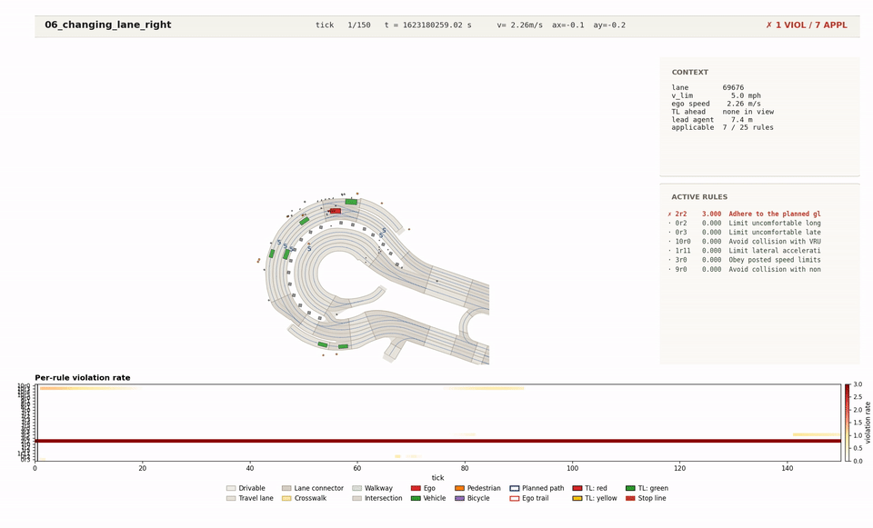

# 06 — Changing Lane (To Right)

> **nuPlan scenario type.** `changing_lane_to_right`
> **Behaviour class.** Lane change
> **Episode duration.** ~15 s (150 ticks)
> **Top observed violation.** `2r2` Route Adherence (integrated $44.90$)
> **Total violating rules.** 5 of 25 — the cleanest lane-change instance in the batch

## What happens

The ego transitions from its current lane to the lane on its **right**. nuPlan tags such instances when the recorded ego heading delta crosses a right-merge threshold mid-scenario. In US right-hand-drive traffic this is typically a right-exit preparation, a slower-lane retreat from passing, or compliance with a "keep right except to pass" prompt.

Notably, **only 5 rules are violated** here — the lowest count of any scenario in the batch. The right-merge in this particular log instance happens in a quieter traffic pocket; no adjacent agents come within lateral-clearance range and no headway issues arise.

## Simulation playback

> **How to watch.** A smooth right-lateral motion with minimal sidebar activity. The bottom violation strip is largely white except for the persistent blue (L2 route adherence) band and a brief teal (L3) blip during the merge itself. A clean visual comparison point for the harder scenarios 03, 10, 12.

Full resolution: [`06_changing_lane_right.mp4`](06_changing_lane_right.mp4). Summary: [`06_changing_lane_right_summary.png`](06_changing_lane_right_summary.png). Log: [`06_changing_lane_right_log.csv`](06_changing_lane_right_log.csv).

## What the LCP-WS-$L_1$ planner does

Same mechanism as scenarios 04 and 05 — periodic global re-extraction shifts the reference; the MPC tracks. The cleaner traffic context means the L1 safety and L3 comfort slacks barely engage; the planner essentially does pure tracking the entire episode.

## Top violations observed

| Rule | Level | Integrated | Why it fires |
|---|---|---:|---|
| `2r2` Route Adherence | L2 | **44.90** | Observer-only; right-merge offset |
| `1r0` Yield Priority | L1 | ~25 | Observer-only |
| `0r2` Longitudinal Comfort | L0 | small | Brief speed adjustment |

## Files in this directory

- [`06_changing_lane_right.mp4`](06_changing_lane_right.mp4) · [`06_changing_lane_right.gif`](06_changing_lane_right.gif) · [`06_changing_lane_right_summary.png`](06_changing_lane_right_summary.png) · [`06_changing_lane_right_log.csv`](06_changing_lane_right_log.csv)
